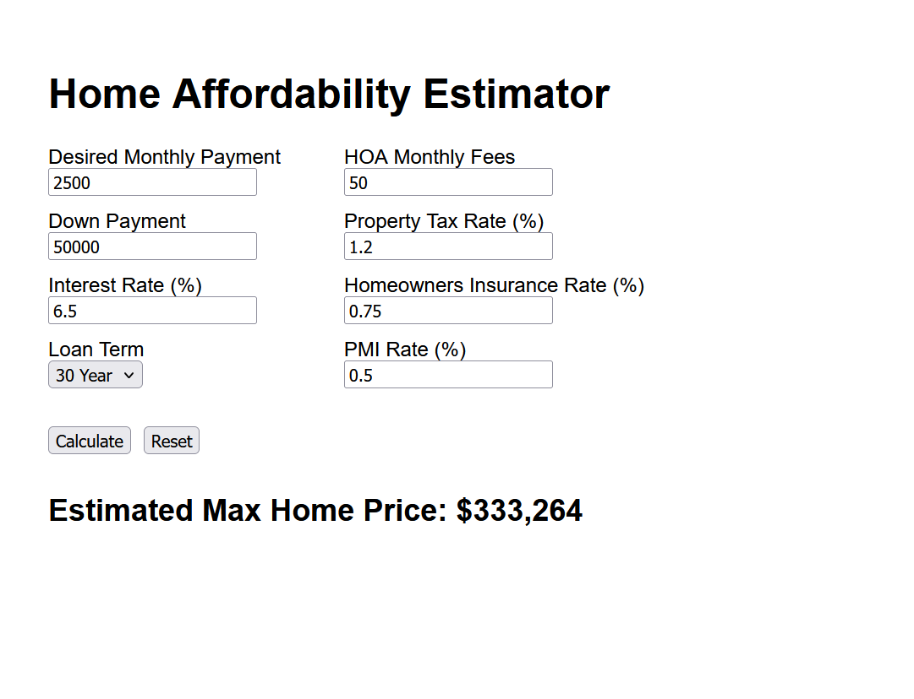

# Home Affordability Estimator

A full-stack web application that estimates the maximum home price a buyer can afford based on their desired monthly payment.

Live link: https://home-affordability-estimator.vercel.app/

## Screenshot



## Tech Stack

### Frontend

* React
* TypeScript
* Vite
* Deployed on Vercel

### Backend

* Java
* Spring Boot
* Maven
* JUnit
* Dockerized
* Deployed on AWS EC2 (Ubuntu)

## Infrastructure
- Docker (containerized backend deployment)
- Nginx (reverse proxy)
- HTTPS via Let's Encrypt (Certbot)
- DuckDNS (domain + DNS)
- AWS EC2 security groups

## Architecture

* React frontend hosted on Vercel sends requests to DuckDNS domain
* DuckDNS domain maps to AWS EC2 instance public IP
* Nginx runs on EC2 instance and handles HTTPS termination using Let's Encrypt certificate
* Nginx forwards requests internally to the backend container running on port 8080

## Features

* Calculates maximum affordable home price
* Supports property taxes, homeowners insurance, PMI, and HOA fees
* Frontend input validation
* Backend request validation
* Unit tested with JUnit
* Deployed frontend & backend
* Containerized backend using Docker

## Running Locally

### Backend

```bash
cd backend
./mvnw spring-boot:run
```

Backend runs on:

```text
http://localhost:8080
```

### Frontend

```bash
cd frontend
npm install
npm run dev
```

Frontend runs on:

```text
http://localhost:5173
```
